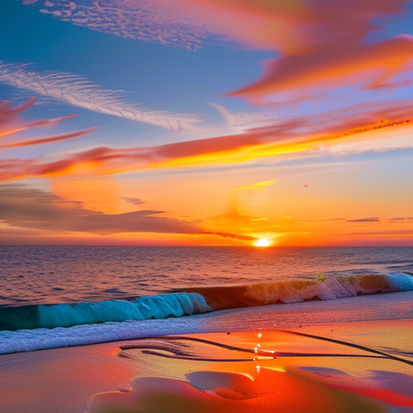

# Diffusion CLI


A command line interface and GUI application for image generation with diffusion models.



## Features

* Generate images from text prompts using state-of-the-art diffusion models
* Command-line interface for quick image generation
* Graphical user interface for interactive image creation
* Support for multiple models from Hugging Face
* Customizable parameters (resolution, inference steps, guidance scale, etc.)
* Optimized for memory usage on GPU

## Setup

Create a new conda environment with all dependencies:

```bash
# Clone the repository
git clone https://github.com/janschlegel/diffusion-cli.git
cd diffusion-cli

# Install uv (if not already installed)
pip install uv

# Create and activate new uv environment
uv venv -p python3.10 diffusion
source diffusion/bin/activate

# Install the package and its dependencies
pip install -e .
```

## Usage

### Command Line Interface

```bash
# Basic usage
diffusion-cli "a beautiful landscape with mountains"

# Specify model and parameters
diffusion-cli "a futuristic cityscape with neon lights" \
  --model stabilityai/stable-diffusion-2-1 \
  --width 768 --height 512 \
  --steps 30 \
  --guidance 7.5 \
  --output-dir ./my-images
```

### Graphical User Interface

```bash
# Launch the GUI
diffusion-gui
```

## Example Prompts

Try these prompts for impressive results:

* `A serene mountain lake at sunset, reflections on water, dramatic sky with purple and orange clouds, majestic pine trees, cinematic lighting, highly detailed`
* `Portrait of a cyberpunk detective with neon city reflected in sunglasses, rain-soaked streets, dramatic lighting, highly detailed, futuristic aesthetic`
* `Ancient steampunk city built on floating islands, brass and copper machinery, steam clouds, victorian architecture, airships, golden hour lighting, detailed engineering, epic scale`
